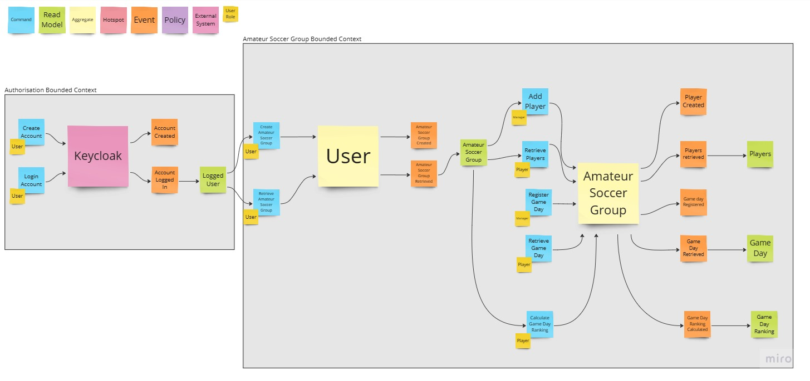

# :soccer: Learning How to Create a Good Modular Monolith

---

## :arrow\_heading\_up: Index

- [:arrow\_heading\_up: Index](#arrowheadingup-index)
- [:green\_book: About](#greenbook-about)
- [:umbrella: Event Storming Diagram](#umbrella-event-storming-diagram)
- [:brain: ADR - Architecture Decision Records](#brain-adr---architecture-decision-records)

---

## :green\_book: About

Started in September 2022, the project has the goal to study and apply different technics to create a good modular 
monolith. This is a project of a client that I had from 2005 to 2011 and the company does not exist anymore and I use
their use cases to study new development approach. It is a Management Tool for Soccer Matches.

Created the first [ADR](https://adr.github.io/) to define [the architecture decisions](/doc/architecture/decisions),
setup Spring Boot and the gitlab pipeline pointing to my personal kubernetes cluster with 3 raspberry pi.

Implemented the first use cases and aggregates using 
[Domain-Driven Design - DDD](https://martinfowler.com/bliki/DomainDrivenDesign.html), unit/integration/system tests.

After implement some Aggregates using the onion architecture, I decided to migrate the simple aggregate to 1 layer
architecture using [Spring Data Rest](https://spring.io/projects/spring-data-rest).

The React.js was added to the project in April 2023. The focus was with the workflow and not the design. Also, the web
resources was changed to be [HATEOAS](https://spring.io/projects/spring-hateoas).

After learn about React.js, make sense to have [Spring for GraphQL](https://spring.io/projects/spring-graphql) and avoid
multiple sequential call to the backend.

## :umbrella: Event Storming Diagram

In August 2023 I decided to redo the event storming diagram. The new diagram groups the Amateur Soccer Group and Ranking
aggregates and create a new User aggregate. Those changes will be added to the code soon.

## :brain: ADR - Architecture Decision Records

- [0001: Record architecture decisions](doc/architecture/decisions/0001-record-architecture-decisions.md)
- [0002: Spring boot as main framework](doc/architecture/decisions/0002-spring-boot-as-main-framework.md)
- [0003: Api Versioning](doc/architecture/decisions/0003-api-versioning.md)
- [0004: OpenAPI Api Documentation](doc/architecture/decisions/0004-openapi-api-documentation.md)
- [0005: Gitlab pipeline for Tests](doc/architecture/decisions/0005-gitlab-pipeline-for-tests.md)
- [0006: Gitlab pipeline to deploy Stage and Production](doc/architecture/decisions/0006-gitlab-pipeline-to-deploy-stage-and-production.md)
- [0007: Setup Identity and Access Mgmt for the Apis](doc/architecture/decisions/0007-identity-and-access-mgmt-for-the-apis.md)
- [0008: Enforcing the Architecture with ArchUnit](doc/architecture/decisions/0008-enforcing-the-architecture-with-archunit.md)
- [0009: Architecture Design](doc/architecture/decisions/0009-architecture-design.md)